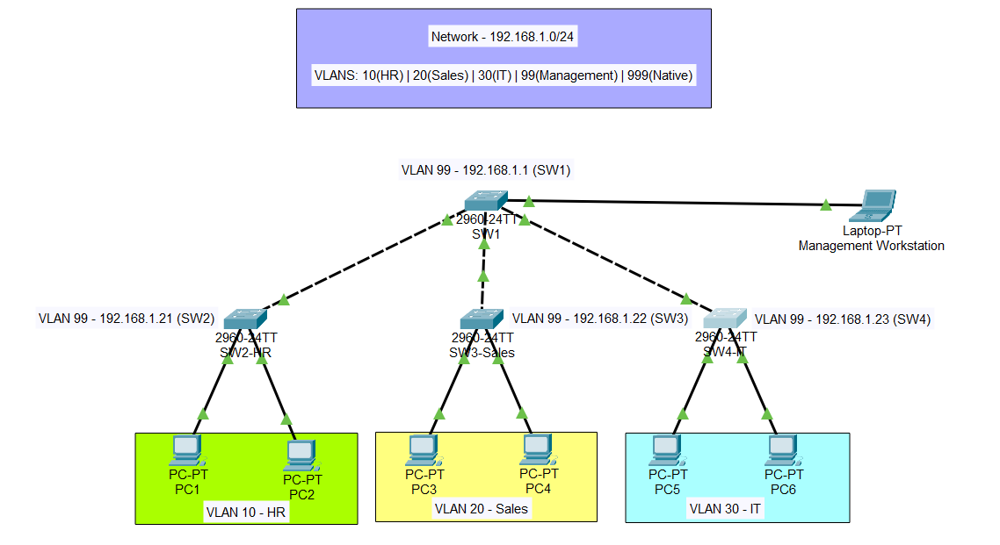

# Lab 02: VLANs & Trunking (802.1Q Hardened)

← [Back to Main Project](../../README.md)

## 📌 Project Overview

- **Target Certification:** Cisco CCNA 200-301
- **Status:** Completed & Verified (Hardened)
- **Difficulty:** ⭐⭐⭐☆☆
- **Environment:** Cisco Packet Tracer 8.x / Physical Hardware
- **Prerequisites:** [Lab 01: Basic Switch Security (SSH & Security Baseline)](../01-basic-switch-config/README.md)
- **Objective:** Implement secure network segmentation using 802.1Q trunking, prevent DTP/VTP (Dynamic Trunking Protocol/VLAN Trunking Protocol) exploits, and isolate management traffic using a "Dead-End" Native VLAN.

---

## 🗺️ Network Topology



### VLAN & IP Scheme

| VLAN ID | Name          | Subnet          | Gateway      | Purpose              |
| ------- | ------------- | --------------- | ------------ | -------------------- |
| 10      | HR            | 192.168.10.0/24 | .10 (Lab 06) | Human Resources      |
| 20      | SALES         | 192.168.20.0/24 | .10 (Lab 06) | Sales Department     |
| 30      | IT            | 192.168.30.0/24 | .10 (Lab 06) | IT Department        |
| 99      | MANAGEMENT    | 192.168.1.0/24  | .10 (Lab 06) | Switch Management    |
| 999     | NATIVE_UNUSED | N/A             | N/A          | Dead-End Native VLAN |

> 💡 **Architectural Note on Subnets in Layer 2:** Even though Layer 2 switches forward traffic based on MAC addresses and do not "read" IP subnets, we specify the IP scheme here for two reasons:
>
> 1. Logical Mapping: Maintaining a 1:1 ratio between VLANs and Subnets is an industry standard. This ensures our Layer 2 boundaries align with the routing boundaries we will create in Lab 06 (Router-on-a-Stick).
> 2. Management Access: The Management VLAN (99) requires an IP scheme immediately so we can assign SVIs (Switch Virtual Interfaces). This allows for remote SSH management, removing the need for a physical console cable.

---

## 🛠️ Implementation Checklist

### 1. Global Hardening (VTP & VLANs)

Before configuring ports, we set the VTP mode to Transparent. This ensures that the switch does not participate in VTP synchronization, preventing accidental database overwrites.

**On All Switches (SW1 - SW4):**

```
SW1(config)# vtp mode transparent
SW1(config)# vlan 10,20,30,99,999
SW1(config-vlan)# exit
```

> **Security Note:** VTP Transparent mode is a best practice in modern networks to avoid the "VTP Bomb" effect, where a switch with a higher revision number can wipe out the VLAN database of all other switches in the domain.

---

### 2. Configure Management SVIs

**On SW1 (Distribution):**

```
SW1(config)# interface vlan 99
SW1(config-if)# ip address 192.168.1.1 255.255.255.0
SW1(config-if)# no shutdown
SW1(config)# ip default-gateway 192.168.1.10
```

Repeat for SW2 (.21), SW3 (.22), and SW4 (.23).

> **Note on SSH:** For remote management to function, ensure crypto key generate rsa has been run on all switches. Refer to the SSH setup steps in [Lab 01: Basic Switch Security](../01-basic-switch-config/README.md).

---

### 3. Hardened Trunk Configuration (802.1Q)

We manually define trunks to disable DTP (Dynamic Trunking Protocol) and set a non-data Native VLAN to prevent VLAN Hopping.

**On SW1 (Distribution):**

```
SW1(config)# interface range f0/1 - 3
SW1(config-if-range)# switchport mode trunk
SW1(config-if-range)# switchport nonegotiate
SW1(config-if-range)# switchport trunk native vlan 999
SW1(config-if-range)# switchport trunk allowed vlan 10,20,30,99
```

**On Access Switches (Example SW2):**

```
SW2(config)# interface f0/3
SW2(config-if)# switchport mode trunk
SW2(config-if)# switchport nonegotiate
SW2(config-if)# switchport trunk native vlan 999
SW2(config-if)# switchport trunk allowed vlan 10,99
```

**Technical Reasoning:**

- **nonegotiate:** Disables DTP. This prevents a malicious user from using a tool like Yersinia to spoof a switch and negotiate a trunk to capture traffic from all VLANs.
- **native vlan 999:** By moving untagged traffic to a "Dead-End" VLAN that has no users and no IP, we mitigate VLAN Hopping (Double-Tagging) attacks.

---

### 4. Access Ports & Port Hardening

**On SW2 (HR Switch):**

```
SW2(config)# interface range f0/1 - 2
SW2(config-if-range)# switchport mode access
SW2(config-if-range)# switchport access vlan 10
SW2(config-if-range)# exit

SW2(config)# interface range f0/4 - 24
SW2(config-if-range)# shutdown
```

---

## 🛡️ Security Threat Glossary

### **1. VLAN Hopping (Double-Tagging)**

A technique where an attacker sends a frame with two 802.1Q tags to bypass VLAN isolation.

**The Attack:** The first switch strips the outer "Native" tag, and the second switch processes the inner tag, delivering the packet to a "victim" VLAN.

**The Defense:** We moved the Native VLAN to 999, a VLAN with no active ports or routing. Since the Native VLAN no longer matches the attacker's VLAN, the "hop" is blocked.

### **2. The "VTP Bomb"**

Occurs when a switch with a higher VTP Revision Number is added to a network, overwriting the entire VLAN database of all other switches.

**The Attack:** If the new switch has no VLANs, it can delete every VLAN in your company, causing a total network outage.

**The Defense:** By using vtp mode transparent, our switches ignore incoming VTP updates and maintain their own databases, making them immune to revision overrides.

---

## ✅ Verification Results

### Test 1: Trunk Security Status

```
SW1# show interfaces trunk
```

**Expected:** Ports show Mode: on, Encapsulation: 802.1q, and Native vlan: 999.

### Test 2: VLAN Isolation

- **Intra-VLAN:** PC1 pinging PC2 (VLAN 10) → ✅ SUCCESS
- **Inter-VLAN:** PC1 pinging PC3 (VLAN 20) → ❌ FAIL

> **Note:** Connectivity to the Gateway (.1) will not work until the Router-on-a-Stick configuration in Lab 06.

### Test 3: Centralized Management Access (VLAN 99)

Testing the ability to manage access switches from a central workstation connected to SW1.

- Action: From Management PC (192.168.1.30) connect via SSH to SW2 (192.168.1.21).

- Alternative: Run ssh -l admin 192.168.1.21 from the SW1 CLI.

- Expected Result: ✅ SUCCESS (Remote access granted via VLAN 99).

> **Note:** The access port connecting the management PC on SW1 must be in VLAN 99.

```
SW1(config)# interface f0/4
SW1(config-if)# switchport mode access
SW1(config-if)# switchport access vlan 99
SW1(config-if)# exit
```

---

## 🐛 Troubleshooting

**Issue:**
Console flooded with %CDP-4-NATIVE_VLAN_MISMATCH messages.

**Root Cause:** During configuration, SW1 was updated to Native VLAN 999 while SW2 was still on the default VLAN 1. CDP (Cisco Discovery Protocol) detected the mismatch across the link.

**Resolution:** Once the configuration was mirrored on SW2, the logs stopped. Lesson Learned: In production, configure both ends of a trunk link rapidly or disable CDP temporarily to keep logs clean during maintenance windows

---

## 📚 Key Skills Mastered

- **VTP Mitigation:** Protecting the VLAN database using Transparent mode
- **DTP Hardening:** Disabling auto-negotiation to prevent unauthorized trunking
- **VLAN Hopping Defense:** Implementing a "Dead-End" Native VLAN
- **Layer 2 Security:** Disabling unused ports and separating management traffic

---

## 🔗 Related Labs

- **Previous:** [Lab 01: Basic Switch Security](../01-basic-switch-config/README.md)
- **Next:** [Lab 03: VTP & DTP] — Focusing on VTP Server/Client roles and VTP Pruning, which prevents unnecessary broadcast traffic from flooding across trunk links to switches that do not have active ports in those VLANs.
- **Future:** [Lab 06: Router-on-a-Stick]
